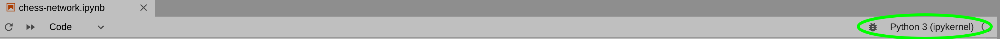

# Creating a Virtual Environment
## Dependencies (python packages)
- venv python package - used to create virtual environments for python
- ipykernel - used to create a kernel to run a virtual environment in Jupyter

Virtual environments provide a way to isolate/"pin" versions of python and any packages you use so that they will not create changes/versioning conflicts with other projects you may be working on.

First, navigate into the `venv` folder in a terminal (if it doesn't exist, create it).

The virtual environment is created by running the following in the terminal from within the `venv` directory of the project:
```
python -m venv chess-env --system-site-packages
```

Now, activate the virtual environment:
```
source chess-env/bin/activate
```

Any pip packages you add install will now be isolated to the `chess-env` environment.

Once the environment is created, we can add its kernel to Jupyter in order to run it from Jupyter Lab
```
python -m ipykernel install --user --name=chess-env
```

To deactivate the virtual environment, just type
```
deactivate
```

To use this environment in Jupyter Lab, open the notebook `chess-network.ipynb` and check the kernel in the upper right hand corner.  If it says `Python 3`, click on it and use the combobox of the dialog that appears to select `chess-env`.



